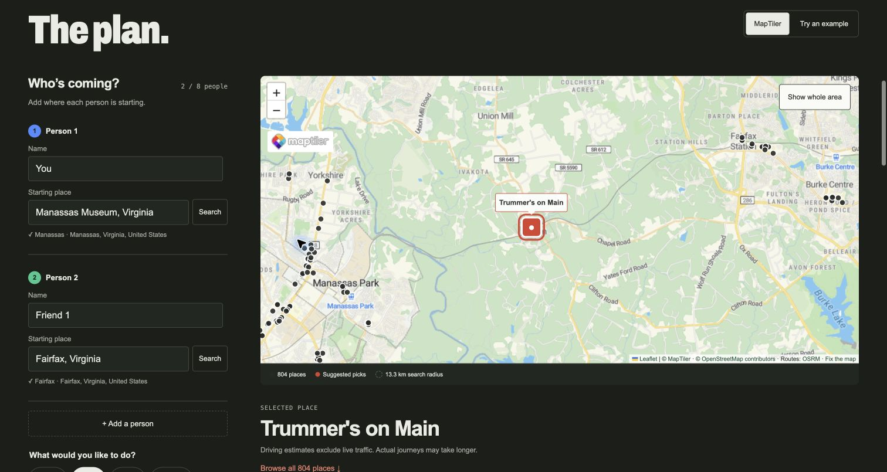

# RouteMeet

RouteMeet helps groups choose a place to meet by comparing the drive from each person’s starting point. It highlights venues with balanced travel times while keeping the full set of mapped places available to browse.

## Preview



The planner supports two to eight people, category filters, individual driving estimates, saved groups, and Apple Maps links with QR codes for a chosen destination.

## Prerequisites

- Node.js 24 or later and npm.
- Git and a modern browser.
- MapTiler API keys for live maps and address search. Example mode runs without keys.

The frontend uses React, Vite, Leaflet, and GSAP. The Express backend uses Node’s built-in SQLite support, so no separate database installation is needed. Live venue searches use OpenStreetMap through Overpass; driving estimates come from OSRM.

## Installation

```sh
git clone https://github.com/muhammad3ilal/routemeet.git
cd routemeet
npm ci --prefix backend
npm ci --prefix frontend
cp backend/.env.example backend/.env
cp frontend/.env.example frontend/.env.local
```

Leave the API keys blank for example mode. For live searches, add a server geocoding key to `MAPTILER_API_KEY` in `backend/.env` and a browser map key to `VITE_MAPTILER_KEY` in `frontend/.env.local`. Both files are ignored by Git. The [MapTiler setup guide](docs/maptiler-setup.md) covers key restrictions and provider settings.

## Quick start

From the repository root, start the backend:

```sh
npm start --prefix backend
```

In a second terminal, start the frontend:

```sh
npm run dev --prefix frontend
```

Open [localhost:5173](http://localhost:5173), choose **Try an example**, then **Find places to meet**. Example venues and travel times are fictional; they exercise the same ranking and saved-plan features.

For a live search, choose **MapTiler**, confirm each person’s starting place, and select a category. Browse the results, compare drives, and choose **Meet here** to open the Apple Maps sharing options. Saved plans stay available after a reset.

The ranking balances the longest drive, the gap between people’s journeys, and total travel time. Up to 32 central venues are compared initially; other venues are compared when selected. Driving estimates exclude live traffic, and venue coverage depends on OpenStreetMap. Saved plans are tied to the current browser, with no account system or cross-device sync.

The [algorithm and storage notes](docs/algorithm-and-storage.md) explain the search geometry, ranking rules, data structures, and SQLite schema.

## Contributing

Bug reports and suggestions are welcome in [GitHub Issues](https://github.com/muhammad3ilal/routemeet/issues). Include the steps to reproduce a problem, what you expected, and what happened. Use public landmarks in examples and remove API keys or personal addresses from screenshots.

## License

No project-wide license has been added. Bundled GSAP code retains its [license notice](frontend/src/vendor/gsap/README.md), and the Archivo font includes its [SIL Open Font License](frontend/public/fonts/OFL.txt).
